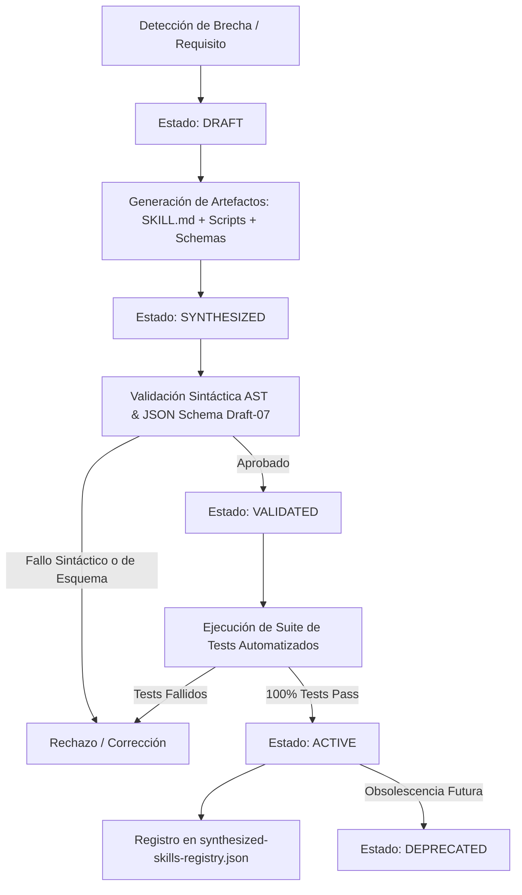

# Skill Architect & Meta-Learning Engine

## Propósito y Filosofía
En la arquitectura ADCRA (*Autonomous Digital Campaign & Creative Production System*), **skill-builder** constituye el estrato meta-cognitivo del sistema. Mientras que los dominios productivos, creativos y analíticos ejecutan las tareas directas de campaña (análisis de audio, generación de copys, edición rítmica, corrección de color, control de calidad), **skill-builder** opera sobre el ecosistema mismo:
1. **Introspección Continua:** Descubre y audita la totalidad de habilidades y contratos formales instalados en `.agents/skills/`.
2. **Detección de Brechas (Capability Gaps):** Identifica necesidades emergentes no cubiertas por los skills fundacionales.
3. **Síntesis Autónoma y Segura:** Genera dinámicamente paquetes completos de nuevas habilidades compuestas por:
   - `SKILL.md`: Documentación con frontmatter estricto, propósito, diagramas de flujo y directrices operativas.
   - Script operacional en `scripts/<script_name>.py`: Código Python modular, fuertemente tipado, con soporte CLI estándar (`--validate-only`, flags contextuales) y validación sintáctica mediante el compilador AST de Python (`ast.parse`).
   - Contrato formal JSON Schema en `config/` cuando se requieran nuevos manifiestos o registros.
   - Tests unitarios en `tests/test_<domain>_<skill_name>.py`.
4. **Gobernanza de Ciclo de Vida:** Administra la progresión controlada de cada skill sintetizado a través de compuertas de calidad inquebrantables.

---

## Taxonomía de los 9 Dominios de ADCRA

Toda habilidad dentro del sistema debe pertenecer taxativamente a uno de los siguientes nueve dominios arquitectónicos:

| Dominio | Propósito Operacional | Responsabilidades Clave |
| :--- | :--- | :--- |
| `strategy` | Dirección estratégica | Brief de campaña, posicionamiento, arcos de conversión. |
| `creative` | Concepción y narrativa | Copywriting multivariante (5 enfoques), storyboards, rationales. |
| `analysis` | Inteligencia sensorial física | Probing de audio (BPM, beats, energía), análisis de metraje y clasificación. |
| `production` | Ensamblado y renderizado | Edición rítmica, Remotion, HyperFrames, safe zones, bucle cerrado de iteración. |
| `tools` | Infraestructura y enrutamiento | Descubrimiento de CLI/APIs y enrutamiento heurístico por velocidad/costo/calidad. |
| `post-production` | Acabado cinematográfico | Scripting DaVinci Resolve 21, etalonaje 3D LUT, diseño y masterización sonora Fairlight. |
| `quality-control` | Certificación tricameral | Auditoría Técnica, Creativa y de Marca (umbral mínimo ponderado 90.0/100). |
| `memory` | Retención cross-campaign | Persistencia de aprendizajes estéticos, temporales, psicográficos y directrices de marca. |
| `meta` | Auto-evolución y gobernanza | Introspección, síntesis de habilidades y auditoría del sistema de agentes. |

---

## Ciclo de Vida de una Habilidad Sintetizada



---

## Principios de Gobernanza y Seguridad de Código

1. **Inmutabilidad de Habilidades Fundacionales:**  
   Queda estrictamente prohibido sobrescribir o modificar de forma no supervisada las 18 habilidades fundacionales de las Fases 1 a 18. Los skills dinámicos se registran en subdirectorios explícitos y con prefijos auditables.
2. **Validación Sintáctica Rigurosa:**  
   Ningún script generado por el sintetizador se escribe en disco sin verificar primero que su árbol sintáctico abstracto (`ast.parse`) compile sin `SyntaxError` ni desvíos estructurales.
3. **Determinismo y Sandboxing:**  
   Los scripts generados deben implementar el flag `--validate-only`, documentar sus dependencias y emitir logs auditables con códigos de salida Unix estándar (0 = éxito, != 0 = error).
4. **Trazabilidad Completa:**  
   Toda transición de estado en el ciclo de vida de un skill sintetizado se registra con timestamp UTC, razón del cambio y reporte de validación en `campaign/meta/synthesized-skills-registry.json`.

---

## Interfaz de Línea de Comandos (CLI)

```bash
# Introspección completa del ecosistema ADCRA
python3 .agents/skills/meta/skill-builder/scripts/skill_synthesizer.py --introspect

# Generación y certificación de skill demostrativo
python3 .agents/skills/meta/skill-builder/scripts/skill_synthesizer.py --synthesize-demo

# Validación del registro formal contra JSON Schema
python3 .agents/skills/meta/skill-builder/scripts/skill_synthesizer.py --validate-only
```
