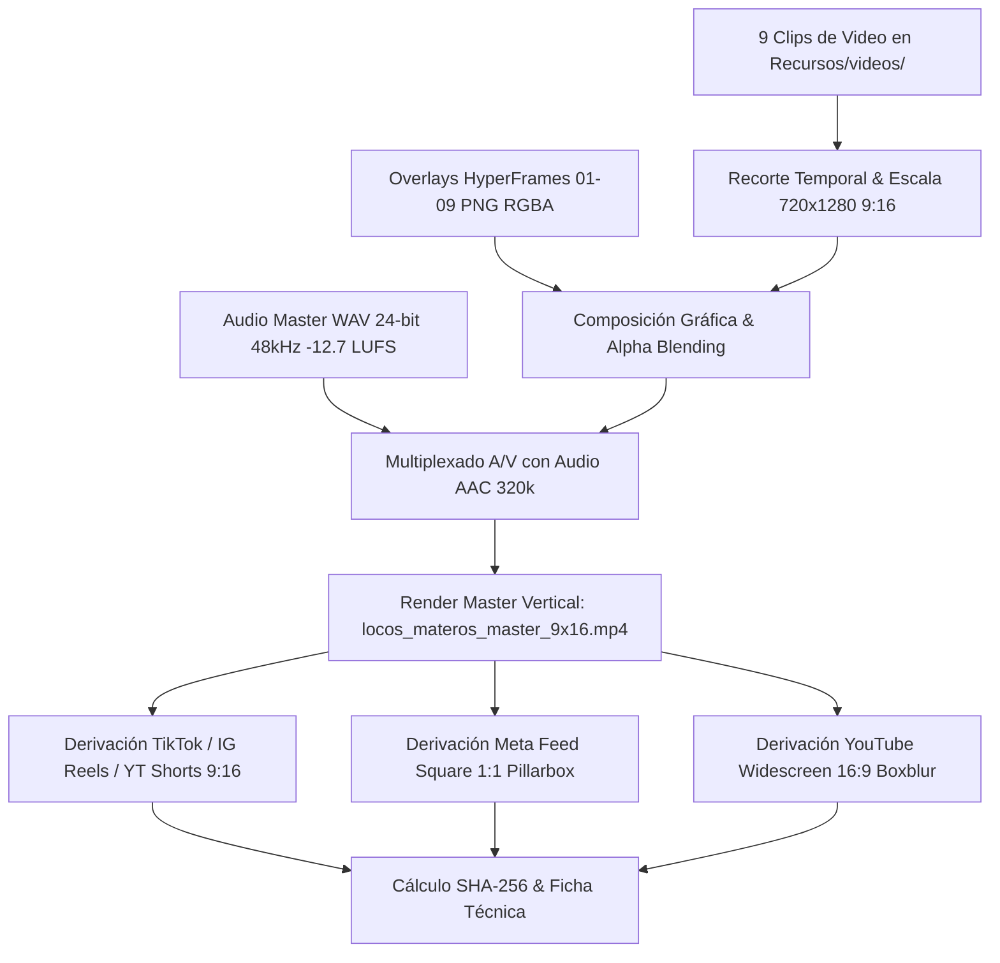

# Campaign Production Master Skill

## Propósito
El **campaign-production-master** es la habilidad terminal de producción de ADCRA (*Autonomous Digital Campaign & Creative Production System*). Transforma los manifiestos, cortes, decisiones de color, diseño de sonido y motion graphics en los entregables físicos finales listos para emisión broadcast y pauta publicitaria digital en redes sociales.

---

## Pipeline de Composición Multicapa



---

## Especificaciones de Entrega Broadcast

1. **Master Vertical 9:16:**
   - **Resolución:** 720x1280 píxeles.
   - **Framerate:** 24.0 fps progresivo.
   - **Códec de Video:** H.264 (High Profile, YUV420p, CRF 18).
   - **Códec de Audio:** AAC estéreo 48 kHz / 320 kbps.
   - **Sonoridad:** -12.7 LUFS integrados (EBU R128 / ITU-R BS.1770-4), -1.0 dBTP ceiling.
   - **Duración:** 29.17 segundos exactos.
2. **Entregables Multiformato Derivados:**
   - `locos_materos_tiktok_9x16.mp4`: Optimizado para feed vertical TikTok.
   - `locos_materos_instagram_reels_9x16.mp4`: Optimizado para Instagram Reels.
   - `locos_materos_youtube_shorts_9x16.mp4`: Optimizado para YouTube Shorts.
   - `locos_materos_feed_square_1x1.mp4`: Adaptación 1:1 con marco institucional verde `#0D5C3A`.
   - `locos_materos_youtube_widescreen_16x9.mp4`: Adaptación 16:9 con fondo desenfocado cinemático (`boxblur`).

---

## Modos de Ejecución CLI

```bash
# Renderizar el master comercial y generar el paquete completo de entrega
python3 .agents/skills/production/campaign-production-master/scripts/produce_final_commercial.py --produce

# Validar el paquete de entrega contra el esquema JSON formal
python3 .agents/skills/production/campaign-production-master/scripts/produce_final_commercial.py --validate-only
```
