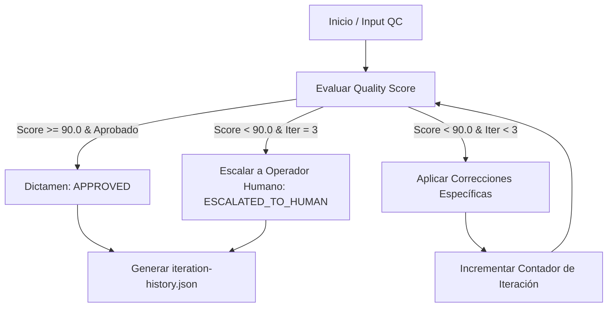

# Feedback & Iteration Engine Skill

## Propósito
Implementa un bucle de retroalimentación cerrado (Closed-Loop Feedback) que detecta desvíos de calidad en la producción audiovisual, ejecuta micro-ajustes correctivos de forma autónoma y re-audita el resultado. Para garantizar predictibilidad operativa y evitar bucles infinitos de consumo de cómputo, el motor impone un **tope estricto e inquebrantable de 3 iteraciones**.

---

## Ciclo de Vida del Bucle Cerrado

---

## Tipología de Acciones Correctivas Autónomas

1. **Correcciones Cromáticas (Color Grading):**
   - Micro-ajustes en balance de blancos, ganancia de altas luces o densidad de sombras para recuperar temperatura de 5900K o contraste Rec.709.
2. **Correcciones Sonoras (Fairlight & Loudness):**
   - Ajuste de perfil de ducking sobre la pista BGM (-3.0 dB a -4.5 dB) o re-cálculo de ganancia de foley para estabilizar sonoridad en -14 LUFS.
3. **Correcciones de Composición (Safe Zones & Tipografía):**
   - Reubicación de tercios inferiores o textos cinéticos para respetar zonas de oclusión UI móvil en TikTok, Reels y Shorts.

---

## Reglas de Parada y Protocolo de Escalamiento

- **Condición de Éxito Inmediato:** Si en la Iteración 1 el Quality Score es $\ge 90.0$ sin alertas bloqueantes, el ciclo concluye con `APPROVED`.
- **Límite Máximo de Iteraciones:** `max_allowed_iterations = 3`.
- **Escalamiento:** Si tras la 3ª iteración el resultado persiste por debajo del umbral mínimo de aprobación, el estado final se marca como `ESCALATED_TO_HUMAN`, documentando los fallos no resueltos para intervención manual.

## Validación Formal
El historial `campaign/reports/iteration-history.json` se valida formalmente contra `config/iteration-engine-schema.json`.
