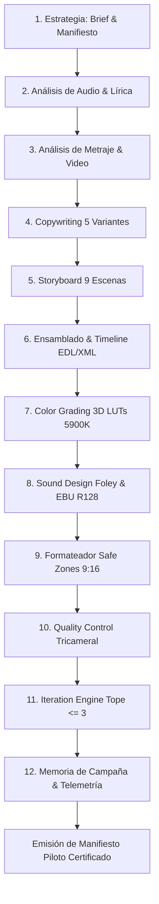

# Pilot Campaign Orchestrator Skill

## Propósito
El **pilot-orchestrator** consolida la ejecución integral y autónoma de la **Campaña Piloto** en ADCRA (*Autonomous Digital Campaign & Creative Production System*). Su objetivo es garantizar que la totalidad de los módulos construidos a lo largo de las fases 1 a 19 operen de forma sinérgica, sin desvíos de metadatos, con 100% de coherencia técnica, creativa y de marca, y generando los entregables finales con certificación formal broadcast.

---

## Cadena Unificada de Producción E2E



---

## Matriz de Verificación de Integridad Cruzada

Para declarar la campaña piloto como `COMPLETED` y `APPROVED`, el orquestador verifica:
1. **Duración Temporal Estricta:** La suma continua de los tiempos de corte de las 9 escenas coincide con 29.187s (delta < 0.05s).
2. **Sincronía Rítmica:** Todos los cortes de escena están indexados a los downbeats y compases de `Entre_mates_y_sol.mp3` (107.7 BPM).
3. **Identidad Cromática:** Las 9 escenas cuentan con corrección de color ligada a la temperatura cinematográfica de 5900K y LUTs 3D `.cube`.
4. **Acústica Broadcast:** La mezcla final `locos_materos_master_mix.wav/mp3` cumple la norma EBU R128 (-12.7 LUFS integrados, -1.0 dBTP ceiling).
5. **Auditoría Tricameral:** El Quality Score alcanza la máxima calificación (100.0/100.0) sin alertas rojas ni amarillas pendientes.
6. **Límite de Iteraciones:** El ciclo concluye en $\le 3$ iteraciones cumpliendo el invariante inquebrantable de ADCRA.

---

## Modos de Ejecución CLI

```bash
# Ejecutar y auditar la campaña piloto completa end-to-end
python3 .agents/skills/production/pilot-orchestrator/scripts/pilot_runner.py --run-pilot

# Validar el manifiesto formal de campaña piloto contra el esquema JSON
python3 .agents/skills/production/pilot-orchestrator/scripts/pilot_runner.py --validate-only
```
