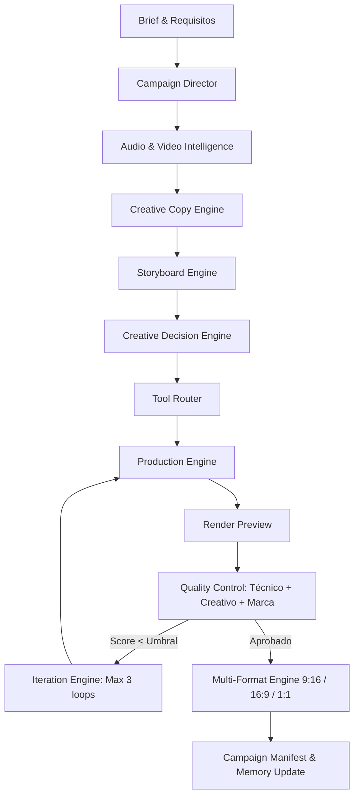

# ADCRA — Arquitectura del Sistema
## Autonomous Digital Campaign & Creative Production System

---

## 1. Visión y Propósito

**ADCRA** no es un editor de video ni un script de automatización monolítico. Es una arquitectura distribuida de habilidades de agentes (*Agent Skills*) diseñada para actuar como una agencia audiovisual completa y autónoma:

- **Estratega de Campañas:** Define el ángulo de ataque según audiencia y objetivos.
- **Director Creativo & Copywriter:** Desarrolla conceptos, hilos narrativos y copys publicitarios que complementan el ritmo y la emoción de la música sin ser simples transcripciones.
- **Analistas Audiovisuales:** Miden métricas físicas reales de audio (duración exacta, BPM, beats, silencios, caídas de energía) y video (estabilidad, iluminación, encuadre, sujetos).
- **Motores de Producción Heterogéneos:** Orquestan dinámicamente **DaVinci Resolve**, **Remotion**, **HyperFrames** y **FFmpeg** seleccionando la herramienta idónea para cada necesidad específica.
- **Control de Calidad en Tres Niveles:** Verificación simultánea de conformidad técnica, excelencia creativa y coherencia de marca.
- **Memoria Continua:** Registra patrones exitosos, rechazos y aprendizajes de campañas previas para evitar repetir errores.

---

## 2. Taxonomía de Módulos y Directorio `.agents/skills`

El sistema se estructura en 9 dominios desacoplados:

```
.agents/skills/
├── strategy/           # Dirección de campaña, posicionamiento y brief
├── creative/           # Copywriting, narrativa, sincronización creativa y toma de decisiones
├── analysis/           # Análisis empírico de audio (BPM/beats) y de assets de video
├── production/         # Ensamblado, orquestación de render, iteraciones y adaptación multiformato
├── tools/              # Descubrimiento de herramientas instaladas y enrutamiento inteligente
├── post-production/    # Automatización de DaVinci Resolve (Timeline, Color, Fairlight, Fusion)
├── quality-control/    # QC Técnico, Creativo y de Marca
├── memory/             # Memoria de marca, aprendizajes y perfiles de cliente
└── meta/               # Creador y auditor dinámico de nuevas habilidades (Skill Builder)
```

---

## 3. Matriz de Contratos Epistemológicos

El Campaign Director y todos los módulos subordinados deben clasificar rigurosamente cada premisa en una de las siguientes cinco categorías obligatorias:

| Categoría | Definición | Regla de Manejo |
| :--- | :--- | :--- |
| `USER_REQUIREMENT` | Instrucción explícita del operador humano en la sesión actual. | Mandatorio. Tiene prioridad sobre cualquier suposición. |
| `CLIENT_REQUIREMENT` | Reglas de marca, directrices de producto o restricciones legales del cliente. | Mandatorio. Se verifica estrictamente en el Brand QC. |
| `CREATIVE_RECOMMENDATION` | Propuesta estilística o narrativa sugerida por un agente especialista. | Modificable. Requiere validación y puntuación de coherencia. |
| `TECHNICAL_REQUIREMENT` | Restricción física o de software (FPS, resolución, codec, memoria GPU, compatibilidad OpenCL). | Inmutable. Impide el avance si no se cumple. |
| `AGENT_ASSUMPTION` | Hipótesis interna generada por un agente ante datos no especificados. | **Prohibido asumir como hecho**. Debe validarse o marcarse como hipótesis sujeta a confirmación. |

---

## 4. Flujo de Datos y Ciclo de Vida de una Campaña



1. **Ingesta & Análisis Real:** Ningún módulo asume la duración del audio o especificaciones del video. Se ejecutan herramientas de probing y análisis de picos y beats reales.
2. **Copywriting Publicitario Desacoplado:** El copy no transcribe la letra musical; la amplifica semántica y emocionalmente en 5 variantes estándar: *emocional*, *publicitaria*, *conversacional*, *minimalista* y de *identidad de marca*.
3. **Storyboard Estructurado:** Define exactamente tiempos, encuadres, audios, copys, estilos tipográficos, transiciones, visibilidad de marca y la herramienta de render asignada por escena.
4. **Enrutamiento Heurístico:** `tool-router` evalúa calidad, velocidad, determinismo y costo para asignar cada escena al motor más potente:
   - *HTML Motion Graphics:* HyperFrames.
   - *Composición React / Variantes masivas:* Remotion.
   - *Timeline cinematográfico, Color grading, Fairlight:* DaVinci Resolve.
   - *Conformado y QC técnico rápido:* FFmpeg / FFprobe.
5. **Bucle Cerrado de Iteración:** Ciclo Plan → Produce → Inspect → Score → Fix → Re-render limitado a un máximo de 3 iteraciones antes de solicitar intervención humana si persiste un error crítico.

---

## 5. Principios de Desempeño y Manejo de Contexto

1. **Progressive Disclosure:** Los agentes no leen el código fuente completo de frameworks o librerías masivas; interactúan con interfaces CLI, flags `--help` y esquemas JSON tipados.
2. **Determinismo y Hashes:** Cada archivo de video y audio cuenta con hash SHA-256 en su inventario para reutilizar análisis y evitar renders duplicados.
3. **Seguridad de Medios:** Flujo inmutable: `SOURCE` → `WORKING` → `PREVIEW` → `MASTER` → `EXPORT`. Jamás se sobrescriben masters originales.
