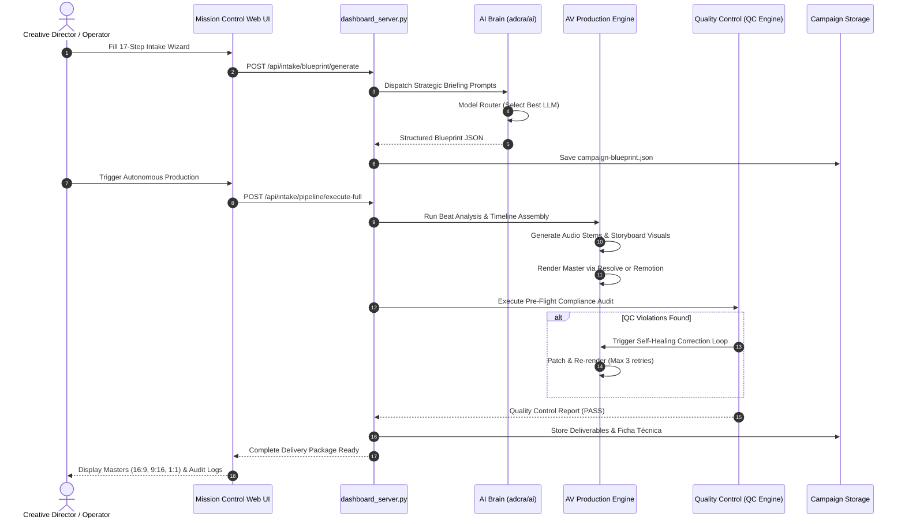

# ADCRA System Architecture
## Autonomous Digital Campaign & Creative Production System

---

## 1. Executive Architectural Overview

**ADCRA** is an enterprise-grade **Creative Operating System** designed to bridge the gap between high-level brand strategy, generative AI intelligence, and professional audiovisual production.

Unlike conventional video automation scripts or isolated text-generation chatbots, ADCRA operates as a **closed-loop autonomous creative pipeline**:

```
[ CLIENT INTENT & BRIEF ]
          │
          ▼
┌────────────────────────────────────────────────────────┐
│  AI BRAIN & AGENTIC ORCHESTRATION LAYER               │
│  • Multi-Model Router (OpenAI / Anthropic / Gemini)    │
│  • Verbal Economy Engine & Token Cost Controller       │
│  • Tool Dispatcher with Role-Based Permissions (RBAC)  │
│  • Epistemic Memory & Dynamic Brand Graph              │
└────────────────────────────────────────────────────────┘
          │
          ▼
┌────────────────────────────────────────────────────────┐
│  CREATIVE EXPERIMENTATION & STORYBOARD ENGINE          │
│  • Beat-Synchronized Timeline Layout                   │
│  • Multi-Variant Copywriting (Hooks, CTAs, Body)       │
│  • Matrix Experimentation (A/B Variations)             │
└────────────────────────────────────────────────────────┘
          │
          ▼
┌────────────────────────────────────────────────────────┐
│  HYBRID AUDIOVISUAL PRODUCTION ENGINE                  │
│  • Mode A: DaVinci Resolve Studio (Fusion/Fairlight)   │
│  • Mode B: Remotion / HyperFrames / FFmpeg (Headless)  │
│  • Hardware Probe (CUDA / Metal / CPU Fallback)        │
└────────────────────────────────────────────────────────┘
          │
          ▼
┌────────────────────────────────────────────────────────┐
│  QUALITY CONTROL & PRE-FLIGHT COMPLIANCE               │
│  • Technical QC (-14 LUFS Audio, Safe Zones, Bitrate)  │
│  • Creative & Brand Safety Assertions                  │
│  • Self-Healing Iteration Loop (Max 3 Auto-Retries)    │
└────────────────────────────────────────────────────────┘
          │
          ▼
[ BROADCAST DELIVERY PACKAGE & SOCIAL DELIVERABLES ]
```

---

## 2. Core Architectural Layers

### Layer 1: Client Intent & Strategic Intake
- **17-Step Strategic Intake Engine**: Captures client profile, value proposition, emotional tone, audience segmentation, core messaging pillars, call-to-actions, and multi-format requirements.
- **Preflight Audit**: Before allocating generative resources, an automated preflight validator checks for missing assets, conflicting duration targets, and brand constraint violations.
- **Session Draft State (`campaign/draft-session.json`)**: Real-time persisted JSON state allowing operators to pause, resume, and inspect campaign drafting.

### Layer 2: AI Brain & Multi-Agent Hierarchy
Located in `adcra/ai/`, this subsystem implements a decoupled, production-grade agent framework:
1. **Agent Gateway (`gateway.py`)**: Unified ingress point for all LLM interactions. Decouples prompts from specific vendor SDKs.
2. **Model Router (`router.py`)**: Evaluates task complexity, cost budget, and latency requirements to route prompts to the optimal model:
   - *Reasoning / High-Strategy*: GPT-4o, Claude 3.5/3.7 Sonnet, Gemini 1.5 Pro.
   - *High-Speed / Low-Cost*: GPT-4o-mini, Claude 3.5 Haiku, Gemini 1.5 Flash.
   - *Local / Air-Gapped*: Ollama / vLLM (Llama 3, Mistral, Qwen).
3. **Verbal Economy Engine (`verbal_economy.py`)**: Enforces strict token ceilings, concise creative output, and structured JSON contracts, preventing hallucinations and wasteful context inflation.
4. **Cost & Telemetry Ledger (`cost.py`, `observability.py`)**: Logs token consumption, per-provider financial costs, latency percentiles, and full prompt/response audits.
5. **Role-Based Access Control (`permissions.py`)**: Enforces strict tool boundaries. (e.g., a *Research Analyst* cannot trigger final timeline renders; only the *Executive Director* can approve master exports).

### Layer 3: Epistemic Memory & Brand Knowledge Graph
Located in `adcra/ai/memory.py` and `campaign/memory/`:
- **Epistemic Classification**: Every data point is tagged as `USER_REQUIREMENT`, `CLIENT_REQUIREMENT`, `EMPIRICAL_DATA`, `CREATIVE_HYPOTHESIS`, or `UNVERIFIED_ASSUMPTION`.
- **Dynamic Brand Knowledge Graph (`campaign-knowledge-graph.json`)**: Stores nodes (Brand, Target Audiences, Color Schemes, Legal Disclaimers, Forbidden Terms) and edges (relates_to, forbids, requires).
- **Episodic Store**: Records previous campaign iterations, user approvals, and operator corrections. The system learns what worked and avoids repeating rejected visual styles or phrasing.

### Layer 4: Hybrid Audiovisual Production Engine
ADCRA supports two complementary rendering pipelines:

| Feature | Mode A: DaVinci Resolve Studio | Mode B: Headless Remotion / FFmpeg |
|---|---|---|
| **Execution Environment** | Creative Workstation (GUI or Scripting) | Headless Cloud VM / Docker / CI/CD |
| **API Interface** | Native Python `DaVinciResolveScript` | Node.js CLI & Python Subprocess |
| **Audio Processing** | Fairlight DAW with VST plugins & automation | FFmpeg filtergraphs & `soundfile` / `scipy` |
| **Color Pipeline** | Color Page with 32-bit float HDR LUTs & CST | FFmpeg LUT filters / CSS filters |
| **Motion Graphics** | Fusion 3D Node Graphs (`.comp`) | React / SVG / WebGL components |
| **Hardware Requirement**| Dedicated GPU (NVIDIA CUDA / Apple Metal) | Flexible (CPU Software or GPU accelerated) |

The **Hardware Probe (`adcra/ai/hardware.py`)** auto-detects GPU capabilities, VRAM limits, and available drivers to select the optimal engine dynamically.

### Layer 5: Quality Control & Self-Healing Loop
- **Three-Tier QC Validation**:
  1. *Technical Compliance*: EBU R128 / ITU-R BS.1770 audio loudness (-14 LUFS ± 1 LUFS), true peak ≤ -1 dBTP, valid frame rates (24/25/30/60 fps), no black frames.
  2. *Creative Integrity*: Hook engagement in first 3 seconds, beat sync alignment accuracy (± 50ms), readable subtitle pacing.
  3. *Brand Safety*: Logo safe margins (10% padding), corporate color hex tolerance (ΔE < 2.0), no prohibited keywords.
- **Autonomous Iteration Engine (`iteration_orchestrator.py`)**: If QC fails, the system diagnoses the root cause (e.g., audio clipping or font overflow), adjusts parameters, and re-renders automatically (up to 3 controlled iterations).

---

## 3. Directory Layout & Subsystem Mapping

```
ADCRA/
├── adcra/                      # Core Python Package
│   └── ai/                     # AI Brain & Agentic Framework
│       ├── approval.py         # Human-in-the-loop and autonomous approval flow
│       ├── context.py          # Session & memory context managers
│       ├── cost.py             # Financial cost ledger & token tracker
│       ├── experiments.py      # Creative Experimentation Lab matrix
│       ├── gateway.py          # Unified LLM provider gateway
│       ├── hardware.py         # Hardware probe (GPU/VRAM/CPU detector)
│       ├── intent.py           # Natural language intent parser
│       ├── memory.py           # Epistemic & episodic memory store
│       ├── models.py           # Multi-provider model definitions
│       ├── observability.py    # Structured audit logging & telemetry
│       ├── orchestrator.py     # Multi-agent coordination engine
│       ├── permissions.py      # RBAC tool permissions matrix
│       ├── planner.py          # Task decomposition & execution planner
│       ├── profiles.py         # AI agent persona & role specifications
│       ├── router.py           # Cost-aware intelligent model routing
│       ├── tools.py            # Tool registry & creative skills dispatch
│       ├── types.py            # Core dataclasses and domain types
│       └── verbal_economy.py   # Strict token compression & prompt optimization
│
├── bin/
│   └── adcra                   # Executable CLI bash wrapper
│
├── campaign/                   # Active Campaign Data & Storage
│   ├── audio/                  # Audio stems, beat detection, and voiceovers
│   ├── color/                  # Color grading manifests and LUT configs
│   ├── creative/               # Copy drafts, slogans, and experiment variations
│   ├── deliverables/           # Rendered master files and social formats
│   ├── memory/                 # Long-term brand profiles and memory vectors
│   ├── motion-graphics/        # Motion manifests and title animation configs
│   ├── reports/                # QC reports, audit logs, and cost ledgers
│   ├── storyboard/             # Visual shotlist and camera direction
│   ├── timeline/               # Beat-synced timeline manifests
│   ├── campaign-blueprint.json # Master creative specification
│   ├── campaign-manifest.json  # Comprehensive pipeline manifest
│   └── draft-session.json      # Live intake wizard draft state
│
├── config/                     # JSON Schemas & Validation Contracts
│   ├── campaign-intake-schema.json
│   ├── iteration-engine-schema.json
│   ├── master-delivery-schema.json
│   └── quality-control-schema.json
│
├── docs/                       # Comprehensive System Documentation
│   ├── ADCRA/                  # Historical audits & implementation reports
│   ├── ai-brain/               # AI Brain technical deep-dives
│   ├── ARCHITECTURE.md         # This document
│   ├── API_REFERENCE.md        # REST API endpoint catalog
│   ├── DEPLOYMENT.md           # Docker & Production deployment
│   ├── EXTENDING_ADCRA.md      # Guide for custom agents & tools
│   ├── GETTING_STARTED.md      # Installation and quickstart
│   └── HARDWARE_AND_PLATFORMS.md # GPU/VRAM & platform matrix
│
├── tests/                      # Automated Regression & Unit Test Suite (317 tests)
│   ├── test_ai_brain_routing.py
│   ├── test_hardware_probe.py
│   ├── test_phase11_beat_synced_editor.py
│   ├── test_verbal_economy.py
│   └── ... (all 22 phases tested)
│
├── web/                        # Mission Control Web UI Static Assets
├── adcra_cli.py                # Command-Line Interface Entrypoint
├── dashboard_server.py         # HTTP REST API & Mission Control Web Server
├── Dockerfile                  # Container definition for cloud/headless
├── docker-compose.yml          # Production orchestration config
├── requirements.txt            # Python production dependencies
├── requirements-dev.txt        # Python development & testing dependencies
└── README.md                   # Repository landing page & overview
```

---

## 4. Architectural Data Flow: Brief to Delivery



---

## 5. Security Architecture

1. **Path Sanitization**: All file artifacts accessed through the `/api/artifact` endpoint are rigorously validated against directory traversal attacks (`../` or absolute escape paths).
2. **Secret Isolation**: Sensitive API credentials (`OPENAI_API_KEY`, etc.) are loaded solely via environment variables or `.env` files and are never written to telemetry, reports, or client responses.
3. **Deterministic State**: State mutations occur via atomic JSON writes to prevent race conditions or partial file corruption during concurrent operations.
4. **Least Privilege**: Agent tools run with strict parameter validation backed by JSON Schemas (`jsonschema`).
